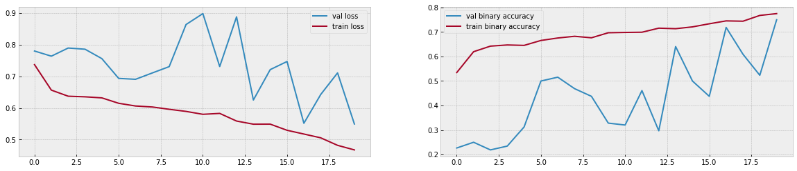
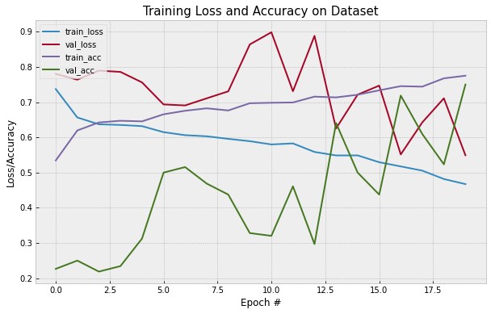
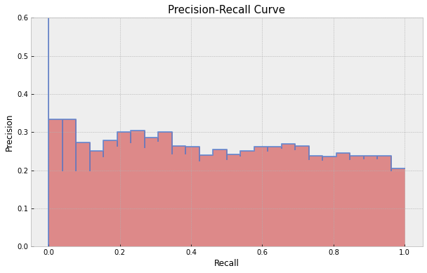
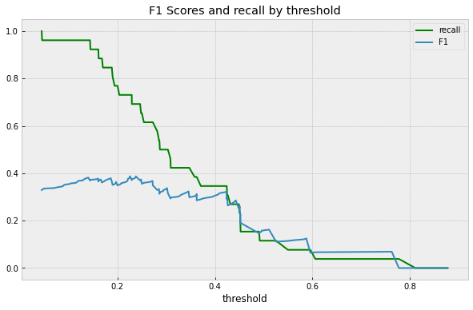
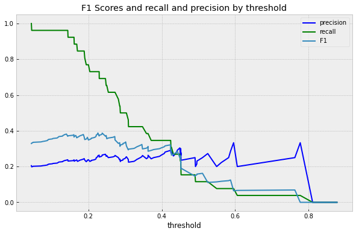
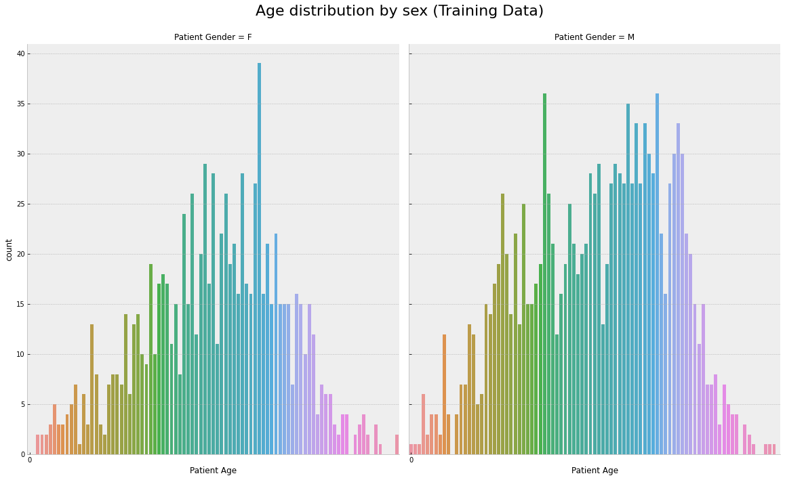

# FDA  Submission

**Your Name:** Alex Tkatchev

**Name of your Device:** X-Ray Pneumonia Detection Assistant using X-Ray Images

## Algorithm Description 

### 1. General Information

**Intended Use Statement:** Assist radiologist in detecting presence or absence of pneumonia in chest X-Ray images. 

**Indications for Use:** The trained algorithm (model) should be integrated into the normal workflow of the diagnostic clinics to assist radiologists in screening of pneumonia presence or absence in X-Ray image. The X-Ray image should be in DICOM format. The target population is men and women from 1 to 100 yeas of age. 

The image is first validated to confirm 
- Modality: DX (Digital Radiography)
- View Position: AP (Anterior/Posterior) or PA (Posterior/Anterior)
- Body part: Chest

After validation a prediction is made and sent to the radiologist for them to give the final verdict.

**Device Limitations:** The trained algorithm (model) performs better without Consolidation, Edema, Effusion, Hernia, comorbid thoracic pathologies due to their pixel intensity distribution similarity to pneumonia. 

**Clinical Impact of Performance:**

The above shows the distribution of diseases among gender and also highlights that Pneumonia is a small portion of the dataset.

The algorithm (model) is trained for Pneumonia only and is better at classifying healthy patients than pneumonia patience. The confusion matrix is as follows on the validation set.

Confusion Matrix
- TP: 179
- FP: 600
- FN: 16
- TN: 229

The trained algorithm (model) has both false positive and false negatives. A false positive results erroneously labels a person having pneumonia with consequences including unnecessary hospital visits. False negative results are more consequential, because the patient with pneumonia may not get treatment. Therefore, the trained algorithm (model) should should not be used in the absence of expert radiologist or a doctor. It is also worth mentioning that healthy cases should still be reviewed by the radiologist as this is supposed to be a supplementary tool.

In terms of predictive value:

-    If the model predicts negative, with 90.5% probability
-    If the model predicts positive, with 26.8% probability

Therefore, the algorithm is recommended for assisting a radiologist screening those images that most probably do not contain Pneumonia, to prioritize his/her time and attention to those that potentially do. This should lead to those that require medical attention getting it much faster.

It is also worth mentioning that when algorithm predicts negative is can still be wrong with 9.5% probability. So, those cases predicted negative should still be reviewed by the radiologist.

### 2. Algorithm Design and Function

**DICOM Check from flow chart Steps:**

The algorithm performs the following checks on the DICOM image:

-    Check Modality is 'DX' (Digital Radiography)
-    Check Patient Position is either 'PA' (Posterior/Anterior) or 'AP' (Anterior/Posterior)
-    Check Examined Body Part is 'CHEST'

**Preprocessing Steps:**
ImageDataGenerator class from the Keras framework was used which allows to build a generator for images specified in training data and provides basic data augmentation such as random horizontal flips etc.

-    Converts RGB to Grayscale (if needed)
-    Re-sizes the image to 244 x 244 (as required by the CNN)
-    Normalizes the intensity to be between 0 and 1 (from original range of 0 to 255

**CNN Architecture:**
The trained algorithm (model) uses transfer learning by taking a pre-trained [VGG16 Neural Network model](https://arxiv.org/pdf/1409.1556.pdf) [documentation link](https://keras.io/api/applications/vgg/) trained on ImageNet data adds 4 blocks of 'Fully Connected + Dropout + Convolution + Pooling ' layers that are re-trained on grayscale images of chest x-rays. The network output is a single probability value for binary classification of pneumonia presence or absence.

### 3. Algorithm Training
                                                  

**Parameters:**
* Types of augmentation used during training
    - rescale: 1. / 255.0
    - horizontal flip
    - height shift: 0.1
    - width shift: 0.1
    - rotation angle range: 0 to 20 degrees
    - shear: 0.1
    - zoom: 0.1
    - samplewise_center: 1
    - samplewise_std_normalization: 1

* Batch size 
    - training :32
    - validation: 1024
* Optimizer learning rate 1e-4
* Layers of pre-existing architecture that were frozen
    - All except last convolution + pooling block
* Layers of pre-existing architecture that were fine-tuned
    - The last 2 layers of VGG16 network: block5_conv3 + block5_pool
* Layers added to pre-existing architecture
- flatten_1 (Flatten)          (None, 25088)
- dense_1 (Dense)              (None, 1024)
- dropout_1 (Dropout)          (None, 1024)
- dense_2 (Dense)              (None, 512)
- dropout_2 (Dropout)          (None, 512)
- dense_3 (Dense)              (None, 256)
- dropout_3 (Dropout)          (None, 256)
- dense_4 (Dense)              (None, 128)
- dropout_4 (Dropout)          (None, 128)
- dense_5 (Dense)              (None, 1)

The loss function is evaluated on both the training and validation data. The plots above show a training loss and a validation loss at the end of each epoch to monitor the models performance.

Lower loss means higher performance. If the model is learning from the training data, after several epochs, the training loss goes down. Since the validation is something that the algorithm never seen, if the model is truly learning, the validation loss will also go down.

Over 25 epochs, we see the training loss continue to decrease as the model learns the features that discriminate classes in this particular set of images better and better.

At a certain point however, the loss plateau, because the model cannot learn how to discriminate between image classes any better with its current architecture and parameters.

Now, while this may look great, in that our model learned a lot about how to discriminate classes in our training data, what we really care about is how its performing on our validation data, or the data that it is not using to update its weights from.

Our validation loss dips, then rises, then dips again. The model is still learning how to better classify the training data, but not the validation data, hence it is starting to overfit. Therefore this epoch was a good place stop and save the weights.

The early stopping with patience of 10 epochs was used to avoid overfitting. The learning rate shown above played a crucial role in achieving the training loss and accuracy plots above.

The behavior of the validation loss during training may indicate a possibility that a lower learning rate could produce better results. This is left for future research.

Precision - Recall Curve

The above precision-recall curve provides insight on choosing a specific threshold. Each point along the graph represents a different threshold value. The threshold value chooses whether to maximize precision or maximize recall. Recall in the x-axis and precision in the y-axis. Each point along the curve represents precision and recall under a different threshold value. In other words the precision-recall curve shows the relationship between precision (positive predictive value) and recall (sensitivity) for every possible cut-off. The PRC is a graph with:

- The x-axis showing recall (sensitivity = TP / (TP + FN))
- The y-axis showing precision (positive predictive value = TP / (TP + FP))

Thus every point on the PRC represents a chosen cut-off. The precision-recall curves
are not impacted by the addition of patients without disease and with low test results. 
The above plot shows sensitivity (recall) to identify the vast majority of persons with a
disease as having the disease. It also show positive predictive value (precision) to identify a
person actually having the disease. Thus, it discriminates persons with pneumonia from those
without pneumonia.

The Reciever Operator Characteristic Curve (ROC) above summarizes the True Postiive Rate (TPR, y-axis) and False Positive Rate (FPR, x-axis). TPR, which is the same as Sensitivity, tells us what portion of pneumonia samples were correctly classified. FPR, tells us the proportion of non pneumonia samples that were incorrectly classified and are False Positive.  

- True Positive Rate = Sensitivity = True Positive/(True Positive + False Negatives)
- False Postive Rate = 1 - Specifcity = False Positive/(False Positive + True Negatives)

ROC Curve is not particularly impressive, but does show that the model has indeed learned something from the data.

**Final Threshold and Explanation:**

As we can see, the model has low precision, but higher recall, and maintains high negative predictive value.

The maximum F1 score for the model is 0.405 and it is achieved with threshold value of 0.405 shown in the F1 Scores by threshold chart above.
Below is the comparison of F1 score with those given in 
[CheXNet: Radiologist-Level Pneumonia Detection on Chest X-Rays with Deep Learning](
https://arxiv.org/pdf/1711.05225.pdf):

| Person or Device | F1    | 95% CI 2sigma| 68% CI 1sigma|
|------------------|-------|--------------|--------------|
| Radiologist 1    | 0.383 |(0.309, 0.453)|(0.345, 0.417)|
| Radiologist 2    | 0.356 |(0.282, 0.428)|(0.319, 0.392)|
| Radiologist 3    | 0.365 |(0.291, 0.435)|(0.327, 0.399)|
| Radiologist 4    | 0.442 |(0.390, 0.492)|(0.416, 0.467)|
| Radiologist Avg. | 0.387 |(0.330, 0.442)|(0.358, 0.414)|
| CheXNet          | 0.435 |(0.387, 0.481)|(0.411, 0.458)|
| XR-PDA Max F1    | 0.408 |              |              |

We do not calculate here the models 95% confidence interval for simplicity, 
and compare models statistical significance by assuming normal distribution 
and comparing the models F1 score to 1-sigma CIs calculated from 2-sigma ones. 
This models score is slightly higher and outside of 68% (1-sigma) CI for 
two radiologists out of four, which points to 'some statistical significance' of the given model.
 
Comparing the F1 scores themselves, this model achieves higher 
maximum F1 score than an average radiologist in the study. State of the art neural network, as well as one radiologist from the study, do achieve higher F1 score, but the models performance is comparable and in many cases exceeds the performance of human radiologists (in terms of F1 score).

Furthermore, since the model does not have a high precision with any meaningful recall value, its usefulness tends to lie in its recall (and negative predictive value). Therefore, it makes sense to maximize recall and NPV even at the cost of small loss in precision.

A good threshold value that achieves that is 0.377:

| Device           | F1    | Precision   | Sensitivity/Recall | Specificity | NPV   |
|------------------|-------|-------------|--------------------|-------------|-------|
| XR-PDA T=0.440   | 0.684 |  0.548      |  0.909             |  0.251      | 0.732 |

If the model predicts negative, it is correct with 90.5% probability. If the model 
predicts positive, it is correct with 54.8% probability.

Out of all negative cases the model correctly classifies 25.1%,
out of all positive cases it correctly classifies 90.8%.

### 4. Databases
**Description of Training Dataset:** 

Training dataset consisted of 1430 chest xray images, with a 50/50 split between 
positive and negative cases. 

**Description of Validation Dataset:** 

Validation dataset consisted of 1430 chest xray images, with 20/80 split between positive and negative cases, which more reflects the occurrence of pneumonia in the real world.

### 5. Ground Truth

The NIH Clinical Centre ChestX-ray8 dataset contains 108,948 frontal-view X-ray images of 32,717 unique patients. Each image in the data set contains multiple text-mined labels identifying 14 different pathological conditions. The data is taken from a larger xray [dataset](https://www.kaggle.com/nih-chest-xrays/data), with disease labels created using Natural Language Processing (NLP) mining the associated radiological reports. The labels include 14 common thoracic pathologies 
(Pneumonia being one of them): 
- Atelectasis 
- Consolidation
- Infiltration
- Pneumothorax
- Edema
- Emphysema
- Fibrosis
- Effusion
- Pneumonia
- Pleural thickening
- Cardiomegaly
- Nodule
- Mass
- Hernia 

The biggest limitation of this dataset is that image labels were NLP-extracted so there could be some erroneous labels but the NLP labeling accuracy is estimated to be >90%.

The original radiology reports are not publicly available but more details on the labeling process can be found [here](https://arxiv.org/abs/1705.02315). 

### 6. FDA Validation Plan

**Patient Population Description for FDA Validation Dataset:**

The following population subset is to be used for the FDA Validation Dataset:
* Both men and women 
* Age 1 to 100 
* Without known comorbid thoracic pathologies listed above

**Ground Truth Acquisition Methodology:**

Doctors review medical history, perform a physical exam, and order diagnostic tests to
diagnose pneumonia. The golden standard for obtaining ground truth would be to perform
one of these diagnostic tests:

- Blood tests such as a complete blood count (CBC) to see if your immune system is
actively fighting an infection.
- Sputum test.
- Chest computed tomography (CT) scan to see how much of your lungs is affected.
- Pleural fluid culture

The use of these tests along with X-ray images will allow the radiologists to diagnosis
pneumonia. An average of radiologists diagnosis can be used as a 'silver standard'

The tests are very expensive, and in most cases diagnosis is concluded by the physician based on radiologist's analysis/description. Since the purpose of this device is assisting the radiologist (not replacing the radiologist), the ground truth for the FDA Validation Dataset can be obtained as an average of three practicing radiologists (as a widely used 'silver standard'). The same method is used in the mentioned paper.  

**Algorithm Performance Standard:**

The algorithm's performance in terms of clinical performance can be measured by calculating F1 score against 'silver standard' ground truth as described above.  The algorithm's F1 score should exceed **0.387** which is an average F1 score taken over three human radiologists, as given in [CheXNet: Radiologist-Level Pneumonia Detection on Chest X-Rayswith Deep Learning](https://arxiv.org/pdf/1711.05225.pdf), where a similar method is used to compare device's F1 score to average F1 score over three radiologists.

A 95% confidence interval given in the paper for average F1 score of 0.387 
is (0.330, 0.442), so algorithm's 2.5% and 97.5% percentiles should also be calculated to get 95% confidence interval. This interval, when subtracted the interval above for the average, should not contain 0, which will indicate statistical significance of its improvement of the average F1 score. The same method for assessing statistical significance is presented in the above paper. 
